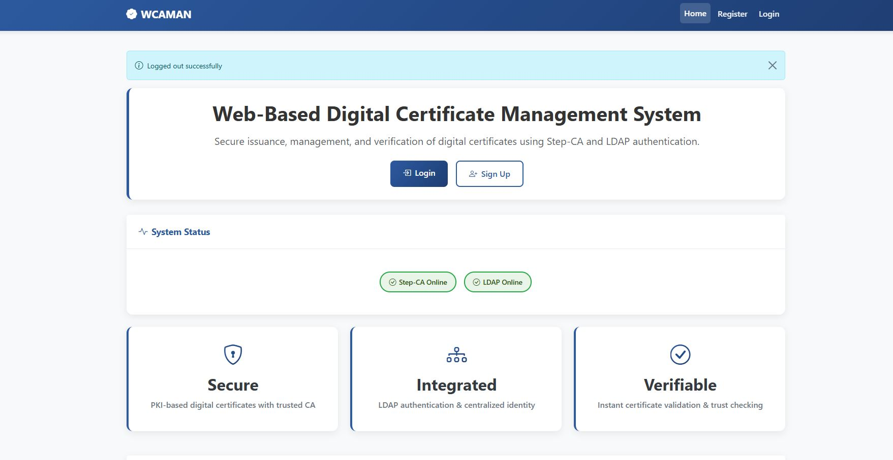
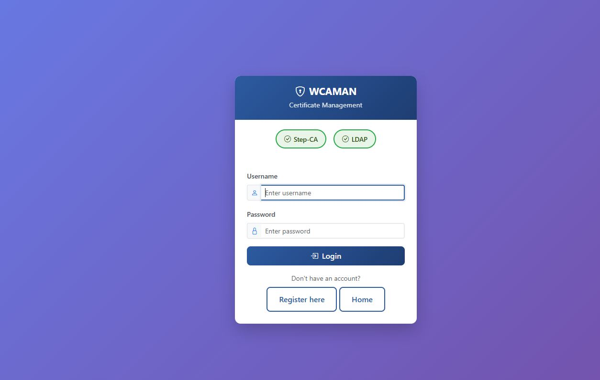
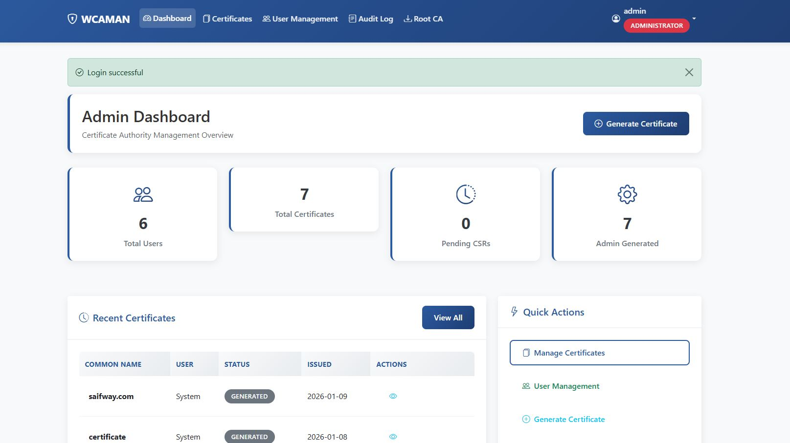
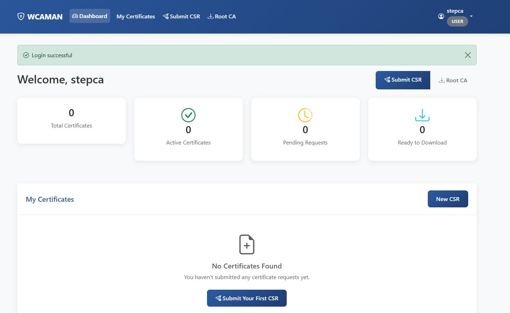
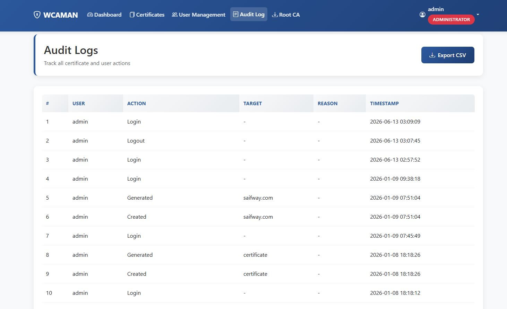

# Web-Based Digital Certificate Management Portal

## Overview

The Web-Based Digital Certificate Management Portal is a Flask-based Public Key Infrastructure (PKI) management platform designed to simplify digital certificate lifecycle operations within an enterprise environment.

The application integrates with Step CA and OpenLDAP to provide centralized certificate issuance, revocation, user authentication, certificate monitoring, and administrative management through a web-based interface.

This project was developed and tested in a virtualized laboratory environment using VirtualBox, Ubuntu Server, Step CA, OpenLDAP, and SQLite.

---

## Key Features

* User registration and authentication
* LDAP-based user authentication using LDAP3
* Role-Based Access Control (RBAC)
* Certificate Signing Request (CSR) submission
* Certificate issuance using Step CA
* Certificate revocation management
* Certificate inventory management
* Certificate status validation
* Certificate expiration monitoring
* Audit logging
* Administrative dashboard
* User management
* Root CA certificate distribution
* Downloadable issued certificates

---

## Technology Stack

### Backend

* Python
* Flask

### Identity and Access Management

* OpenLDAP
* LDAP3

### Public Key Infrastructure (PKI)

* Step CA
* Step CLI

### Database

* SQLite

### Security and Automation

* Paramiko
* Certificate Lifecycle Management
* RBAC

### Frontend

* HTML
* CSS
* JavaScript
* Bootstrap

---

## Architecture

The application interacts with external PKI and identity services running inside an Ubuntu Server virtual machine.

```text
Users
   │
   ▼
Flask Web Application
   │
   ├── LDAP3 Authentication
   │       │
   │       ▼
   │    OpenLDAP
   │
   ├── Step CLI Operations
   │
   └── Step CA Integration
           │
           ▼
        Step CA

Database:
SQLite
```

---

## Development Environment

### Host Machine

* Windows 11/10

### Virtualization Platform

* Oracle VirtualBox

### Guest Operating System

* Ubuntu Server

### Services Running Inside Virtual Machine

* Step CA
* Step CLI
* OpenLDAP

### Application Layer

* Flask Web Application

### Database

* SQLite

The application communicates with Step CA using Step CLI commands and service integrations, while user authentication is performed using OpenLDAP through the LDAP3 Python library.

---

## Project Screenshots

### Home Page



### Login Page



### Admin Dashboard



### User Dashboard



### Certificate Management


### Audit Logs



---

## Project Documentation

Additional documentation is available within the `docs` directory.

### Included Documentation

* Architecture Diagram
* Use Case Diagram
* Class Diagram
* Sequence Diagrams
* Application Screenshots

---

## Important Notes

This repository contains a laboratory implementation intended for educational, demonstration, and portfolio purposes.

The included certificates, keys, domains, IP addresses, usernames, and credentials were created exclusively for testing within a simulated environment and do not represent production infrastructure.

The included SQLite database is provided solely for demonstration purposes.

---

## ACME Automation Disclaimer

Although the project structure contains preliminary ACME-related components, a complete Automated Certificate Management Environment (ACME) implementation is not included.

Full ACME automation requires additional infrastructure components including:

* DNS validation services
* Automated renewal workflows
* ACME clients
* Production PKI deployment architecture

These components are outside the scope of this demonstration project.

---

## Learning Outcomes

This project demonstrates practical experience in:

* Public Key Infrastructure (PKI)
* Digital Certificate Management
* Identity and Access Management (IAM)
* LDAP Authentication
* Role-Based Access Control
* Security Automation
* Python Development
* Flask Application Development
* Infrastructure Security
* Enterprise Security Concepts

---

## Author

Imran Sarwar

### Areas of Interest

* Cybersecurity
* Security Engineering
* PKI and Certificate Management
* Identity and Access Management
* Network Security
* Python Automation
* Infrastructure Security
* DevNet
* Machine Learning for Cybersecurity

---

## License

This project is provided for educational and demonstration purposes.
